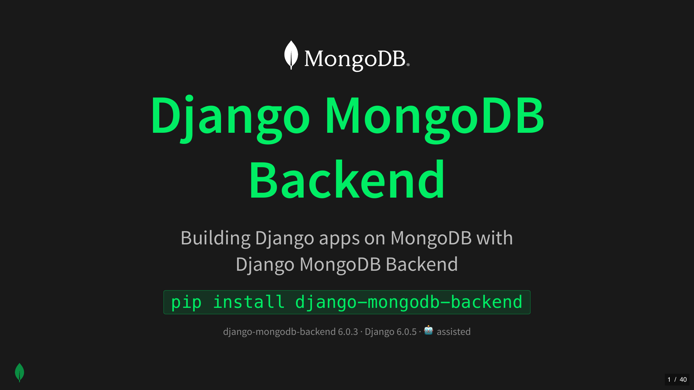

# django-mongodb-slides



Video — [An Evening of Python Coding 2026 05 19](https://www.youtube.com/watch?v=mA-UgdzqMIY)

A [reveal.js](https://revealjs.com/) slide deck on building Django apps
on MongoDB with [`django-mongodb-backend`](https://github.com/mongodb/django-mongodb-backend).

The deck walks through install, configuration, the project template,
modeling with embedded documents and arrays, querying and aggregation,
indexes, constraints, what's new in the 6.0 series, and a runnable
[`polls`](https://github.com/aclark4life/polls) app demo.

## View the slides

```bash
just open
```

…or open `index.html` in any browser. There is no build step.

## Layout

| Path                                  | What it is                                  |
| ------------------------------------- | ------------------------------------------- |
| `index.html`                          | The deck (single file, CDN-hosted reveal.js) |
| `assets/mongodb/`                     | MongoDB brand SVGs                          |
| `assets/startproject-screenshot*.png` | Terminal screenshots used in the deck        |
| `assets/slide1-01.png`               | Title slide image used in this README        |
| `slides.pdf`                          | Exported PDF of the slide deck               |
| `justfile`                            | Recipes for the demo workflow                |

## `justfile` recipes

```
$ just
Available recipes:
    clean        # Remove the generated demo project directory (start fresh with `just startproject`) [alias: c]
    dbshell      # Open a MongoDB shell against the demo database [alias: d]
    default      # List available recipes
    dropdb       # Drop the demo database (handy between demos) [alias: x]
    migrate      # Apply migrations against the demo database [alias: m]
    open         # Open the slides in the default browser [alias: o]
    polls        # Install polls, wire it into the demo project's settings + urls, and seed data [alias: p]
    runserver    # Run the Django dev server with MONGODB_URI wired up [alias: r]
    shell        # Open a Django shell against the demo database (IPython, vi key bindings) [alias: h]
    startproject # Scaffold the demo project from the mongodb-labs/django-mongodb-project template [alias: s]
    su           # Create Django superuser (admin / admin) [alias: u]
```

The private `_uri` recipe (hidden from `--list`) reuses a running
`mongodb-runner` instance tagged `--id demo`, or starts a fresh one,
and prints its URI. `runserver` and `migrate` use `$(just _uri)` to
wire that URI into `MONGODB_URI` — the same env var the generated
`settings.py` reads.

## Demo workflow

```bash
just startproject     # scaffold ./demo from the mongodb-labs project template
just polls            # install & configure the polls app, run migrate, seed data
just runserver        # http://127.0.0.1:8000/polls/

just dropdb           # wipe the database between runs
just clean            # rm -rvf demo
```

## Requirements

- [`just`](https://github.com/casey/just)
- Python 3.12+ with `django` and `django-mongodb-backend` installed
- [`mongodb-runner`](https://www.npmjs.com/package/mongodb-runner) (Node 20+) for local MongoDB
- [`mongosh`](https://www.mongodb.com/docs/mongodb-shell/) for `dropdb`

## Resources

- Docs — [django-mongodb-backend.readthedocs.io](https://django-mongodb-backend.readthedocs.io/)
- Source — [github.com/mongodb/django-mongodb-backend](https://github.com/mongodb/django-mongodb-backend)
- Project template — [github.com/mongodb-labs/django-mongodb-project](https://github.com/mongodb-labs/django-mongodb-project)
- `polls` — [github.com/aclark4life/polls](https://github.com/aclark4life/polls)
- Atlas free tier — [mongodb.com/atlas](https://www.mongodb.com/atlas)

## License

MIT.
